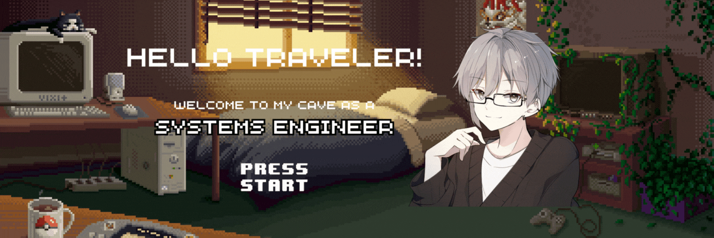

  <h1 align="center">Welcome Forager! Sergio on the way 👋</h1>

- 🔮 Bet for me, future pokemon master and king of duels. 
- 📟 I’m into tech, I suck at games, and I’m weird... but like, the fun kind of weird. 
- 🧠 Passionate about software development - web, mobile, and data analysis. 
- 👾 Picking up pixel art skills, one pixel at a time. 
- 🎮 As a gamer, wait for my own game! (Yes, someday it’ll happen.) 
- 💼 I love collaborating on cool projects, so if you have ideas or want to chat, hit me at:

 
  
  
  
  
  
  

 

  <h2>My Technologies</h2> 

  <h3>Frontend</h3>

  
  
  
  
  
  
  
  

  <h3>Backend</h3>

  
  
  
  
  
  
  
   
  
  
  
  
  
  
  
  

  <h3>Databases</h3>

  
  
  
  
  
  
  
  

  <h3>Data Science & Analysis</h3>

  
  
  
  
  
  
  
   
  
  

  <h3>Others</h3>
  
  
  
  
  
  
  

